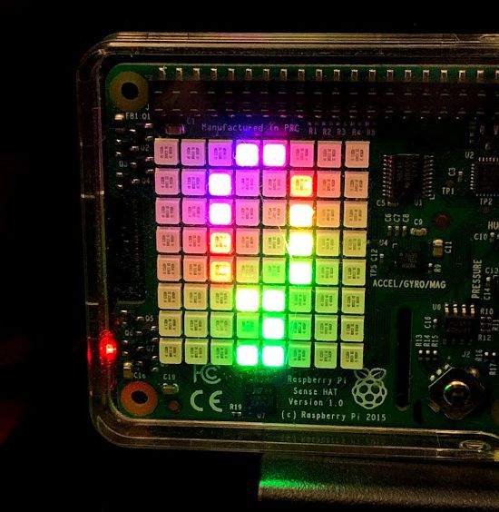

# quantum-raspberry-tie
  
Your Raspberry Pi running code on the IBM Quantum quantum processors via Python 3 -- with results displayed courtesy of the 8x8 LED array on a SenseHat (or SenseHat emulator)!

## April 2024 (Sixth) Release For Qiskit v1.0
This release requires the new v 1.0 release of Qiskit and will not run with older versions.
It defaults to building a local simulator and offers several new options. The rest of this readme will be updated accordingly during May 2024

#### Fifth Release: -dual option:  adding Dual Display option. The -dual parameter will spin up a Sensehat emulator as well as use the display on a physical Sensehat, if one is detected. If no physical hat is installed, this parameter is ignored and the emulator alone will be spun up.
(Only the orientation of the physical display will change according to the rotation of the Raspberry Pi)

#### Fourth Release: -local option: can run on local Aer qasm_simulator backend instead of using IBM Quantum backends via network! -noise option runs local simulator with a noise model based on a real processor. Parses newer version numbers of qiskit properly

#### Third Release: will fail over to SenseHat emulator if no SenseHat hardware is detected. You may opt to send your quantum circuit to an actual quantum processor backend at IBM Quantum instead of the simulator

This code is specifically designed to run on a Raspberry Pi 3 or later with the SenseHat installed. The 8x8 array on the SenseHat is used to display the results.
Alternatively, if no SenseHat is detected, it will launch and use the display on a SenseHat emulator session instead.

If the Pi is held on edge, the accelerometer is used to determine which edge is "up" and orients the qubit display accordingly (default is "up" equals towards the HDMI and USB power in ports).
This version asseses the QASM program being loaded and selects either a 5-qubit or 16-qubit display accordingly. The default is to load and run a 5-qubit random number-generating program.

The 5-qubit display formats output in a manner corresponding to the IBM 5-qubit "bowtie" quantum processor.
 &nbsp;&nbsp;&nbsp;&nbsp;&nbsp;&nbsp;&nbsp;&nbsp;&nbsp;&nbsp;&nbsp;&nbsp;&nbsp;&nbsp;&nbsp;&nbsp;&nbsp;&nbsp;&nbsp;&nbsp;&nbsp;&nbsp;&nbsp;&nbsp;&nbsp;&nbsp;&nbsp;&nbsp;&nbsp;&nbsp;
  
(It's called a bowtie because of the arrangement of the 5 qubits, and the particular ways they can interconnect via entanglement. Each of those rectangles touched by a squiggly line in the image on the left holds a qubit.)

The 16 qubit display corresponds to a 16-qubit processor
 &nbsp;&nbsp;&nbsp;&nbsp;&nbsp;&nbsp;&nbsp;&nbsp;&nbsp;&nbsp;&nbsp;&nbsp;&nbsp;&nbsp;&nbsp;&nbsp;&nbsp;&nbsp;&nbsp;&nbsp;&nbsp;&nbsp;&nbsp;&nbsp;&nbsp;&nbsp;&nbsp;&nbsp;&nbsp;&nbsp;
 

Actual calculations are run using the quantum simulator backend for the quantum processor, to avoid overwhelming the physical processor in the IBM Quantum computing center, unless you specify a real backend using the *-b* parameter. **Specifying a backend other than the simulator will disable the looping component of this program and send the job only a single time to IBM Quantum.**

You may specify using a **local** qiskit-aer simulator by adding the **-local** parameter when starting. This disables all the network apis and can run with no internet connection to IBM Quantum.
You may specify a **noisy** local simulator by using the **-noise** parameter when starting. This has the same effect as -local but builds a simulator based on a model of one of the physical IBM Quantum processors. The default noise model used is *FakeParis*.
You may specify the processor noise model to use by calling the parameter **-noise:Fake*XXXXXX*** where "XXXXXX" represents the system. The list of available models can be found at https://github.com/Qiskit/qiskit-terra/blob/master/qiskit/test/mock/fake_provider.py

The programs can trigger a shutdown of the Raspberry Pi by means of pressing and holding the SenseHat Joystick button straight down. This is very useful when running as a headless demo from battery, as it provides a means of safely shutting down the Pi and avoiding SD card damage even without a screen and input device.
You may also exit execution *without* a shutdown by pressing and holding the joystick button to any side. 
Both joystick events will be detected on the emulator as well as on the SenseHat hardware.

# Installation

## Prerequisites
You will need a Raspberry Pi 3 or later running at least the _Jessie_ release of Raspbian, with a SenseHat* hat properly installed.  

If your processor did not come with the SenseHat libraries pre-installed, you must install them.
     https://www.raspberrypi.org/documentation/hardware/sense-hat/
     
Alternatively, you can install the SenseHat EMULATOR libraries instead, and simulate the SenseHat display on the emulator.
     https://sense-emu.readthedocs.io/en/v1.1/install.html
     
Your Raspberry Pi must have an active internet connection for the API to function properly
     
You will need to install the **qiskit library**
     https://github.com/QISKit/
     
**IMPORTANT:** this new version does require the complete QISKit library, not the simpler API library used before! 
Installing Qiskit and the SenseHat libraries on a Raspberry Pi can be quite complicated; I hope to add more information on the correct sequence of steps to do so. I have successfully installed everything on Raspbian _buster_ running berryconda (python 3.6.6), but it took a bit of work and required compiling 

**Release 2 is compatible with both Qiskit v0.9 and Qiskit v0.12 if you have created your stored credentials properly**

If your Raspberry Pi has more than one version of Python installed, be sure to install the QISKit API library for your Python 3 interpreter!

You must have an account set up at the IBM Quantum Experience and obtain your Personal Access Token from the My Account settings. The introductory material for the IBM Quantum Experience explains how to get that token.

## Customizing the code for your use
**Qiskit v0.9.0** You will need to use the IBMQ.save_account() method to store your API token on your Raspberry Pi.

**Qiskit v0.12.0** You will need to use the new methods to store your API token. If you have upgraded from v0.9, follow the instructions to use the IBMQ.update_account() method.

The real difference between these two versions is in the authentication technique in qiskit-ibmq-provider. The new version (0.3.x) uses a _provider_ object for connections to the backend while the previous version used the IBMQ object.

Download the source code for the QuantumRaspberryTie program and the code should be ready to run!
Be sure to download the OPENQASM files as well (_expt.qasm_ & _expt16.qasm_) for the probram and put them in the same directory as your source file.

# Versions
There is now a single version of the code, which can run in one of two quantum processor-size modes. 
Both require that the **sense-hat**, **sense-emu** and **qiskit** libraries be installed in order to function, and use the **threading**, **time**, and **datetime** modules.

## QuantumRaspberryTie.qiskit.py
Unless running with the **-local** parameter, this program tries to test its connection to the IBM Quantum website before making requests. It's designed to cope somewhat gracefully with what happens if you are running on batteries and your Raspberry Pi switches wireless access points as you move around, or are in a somewhat glitchy wifi environment. It also can now handle gracefully communications timeouts with the IBM Q backend, or the occasional glitch where the simulator queue status for a job gets stuck in "RUNNING" state.

To start the program, simply call it from its directory (on my system, the default version of python is python 3.6.6; add the version number if that is not true on your system):
+     *python QuantumRaspberryTie*  
          will launch with the default (5-qubit) quantum circuit 
          
+     *python QuantumRaspberryTie 16*  
          will launch with the 16-qubit circuit
+     *python QuantumRaspberryTie* _yourprogram.qasm_  
          will launch and attempt to load the circuit specified in file _yourprogram.qasm_
          
## New command line parameters (can be stacked with spaces between them) ##
+    *-e*
          will launch and force use of the SenseHat emulator even if the SenseHat hardware is present
+    *-dual*
          will launch an instance of the SenseHat emulator in addition to using the hardware (if it is present)
          Orientation of the physical display will respond to motion of the Raspberry pi
+    *-b:backendname*
          will attempt to use the IBM Q Experience backend *backendname* instead of the simulator.
          If you use a non-simulator backend, the code will execute only once instead of looping.
          if connection fails, it will fail back to the simulator
+    *-f:qasmfilename*
          will attempt to load the circuit specified in the file *qasmfilename*
          if it can't load the file, will fail back to *expt.qasm*
+    *-local*
          will use the qiskit aer qasm_simulator backend running *on the Raspberry Pi* instead of one at IBM Quantum.
          this can run even if there is no connectivity to the Internet
+    *-noq*          
          will display the rainbow wash in the qubit pattern. Without this parameter, 
          the display will show a Q and run the rainbow wash across that while "thinking"
+    *-tee*
          will display 5-or-less qubit circuit results in  "tee" arrangement like the newer
          processors instead of in the "bowtie" arrangement
     
After loading libraries, the program checks the SenseHat accelerometer to see which way the Pi is oriented. If it is flat on a table, "up" will be towards the power and display connectors on the Pi. If you wish to change the display orientation, simply hold the pi in the orientation you want until an up arrow appears on the display. The program will now use that orientation until the next cycle.

The program then pings the IBM Q Experience website to make sure it has a connection; if not it will exit. 

It then loads the OPENQASM code for the experiment from a separarate text file, _expt.qasm_ (or _expt16.qasm_) which makes it easier to modify your experiment code. If the first ping was successful, in each cycle it pings again before it confirms the backend status and (presuming the backend is not busy) sending the OPENQASM code. If there no good response to the ping, or the backend responds as busy, it waits 10 seconds and tries again, begining again with that initial ping to the website. 

If the ping is good, it then connects to the IBM Quantum Experience API using your token and initializes the LED display (displaying a Q). It compiles the OPENQASM code into a "quantum circuit", echoes the quantum circuit drawing to the terminal. and then sends the quantum circuit to the processor to execute. While it waits for the response, it cycles the light display through a rainbow shift to indicate that the system is "thinking". Once the result is returned by the processor, the measured values of the qubits are displayed as either red (measured 0) or blue (measured 1).

The system will pause for a few seconds, then run the code again (flashing the Q as it starts) to display a new result. You may trigger a new run sooner by pressing the SenseHat joystick in any direction. If you want to change which way on the display is "up" simply hold the Pi in the correct orientation until the Q displays as the cycle starts (the position is measured before sending the job).
*If you specify one of the non-simulator backends using the **-b** option, the program will not run in a loop, but will instead exit after sending the quantum circuit to IBM Q and displaying the result once. This is to avoid burning up your "credits" in the IBM Q Experience.*

In each cycle, the status of the backend is checked and printed to the console, as is the quantum circuit diagram, then the probability value and measured bit pattern of the most-frequent result wich is used for the display

To stop the loop and exit execution, press and hold the joystick button on the SenseHat to any of the 4 sides.

To stop the program and shut down the Pi, press and hold  (center press) the joystick button on the SenseHat. The color display will stop cycling, it will briefly display **OFF** on the LED array, and then the Pi will shut down. When the green light on the Pi stops flashing, it is safe to disconnect power.

**NOTE** If you are running using the SenseHat emulator and click and hold the emulator GUI joystick button, it *will* shut down your rPi. Don't leave unsaved files open if you are going to test this.

Both versions run the display by spawning a second thread. As long as the variable *thinking* is True, the rainbow cycle is run. If it is False, the value of the string variable *maxpattern* is translated into the red and blue qubit display.

The "blinky" and "showqubits" functions in the code are generalized to work with a global *display* variable. Setting that to equal the list defining the 5-qubit processor (ibm_qx5) will result in the bowtie display, setting it equal to the 16 (ibm_qx16) will result in the 16 bit display. New in version 4: the default is for blinky to use the Q logo for the rainbow "thinking" display; specifying -noq as a start parameter will use the qubit pattern instead.

## The OPENQASM code being run
The program being run on the 5-qubit processor is very simple. 5 qubits are initialized to the ground state, a Hadamard gate is applied to each one to place it into a state of full superposition, then each is measured. The net effect is a 5-bit random number generator. Only 10 shots are run, so one pattern should always randomly end up higher in the results. The code is found in the variable *qasm* in both versions. It looks like this:

     OPENQASM 2.0;
     include "qelib1.inc";
     qreg q[5];
     creg c[5];
     h q[0];
     h q[1];
     h q[2];
     h q[3];
     h q[4];
     measure q[0] -> c[0];
     measure q[1] -> c[1];
     measure q[2] -> c[2];
     measure q[3] -> c[3];
     measure q[4] -> c[4];

The 16-qubit version does exactly the same thing only with 16 quantum registers and 16 classical registers. 

## acknowledgements
The color-shifting technique in the "thinking" display while waiting for the result from the processor is based on the rainbow.py example included with the SenseHat library.

The Ping function is based on that in the Pi-Ping program by Wesley Archer (c) 2017 
             https://github.com/raspberrycoulis/Pi-Ping

I also want to acknowledge Alex Lennon of Dynamic Devices, whose work on a docker template for an IOT project gave me hints on getting the Qiskit install to work on my Raspberry Pi : https://github.com/DynamicDevices/does-rpi3-qiskit

## Release History ##
*    v3 : auto-fail over to SenseHat emulator if no SenseHat hardware is detected.
*    v2.1 : additional queue stall exception handling
*    v2.0 : Adapt to version of Qiskit installed
*    v1.0 : uses full Qiskit library; detects orientation of rPi and changes display angle.

