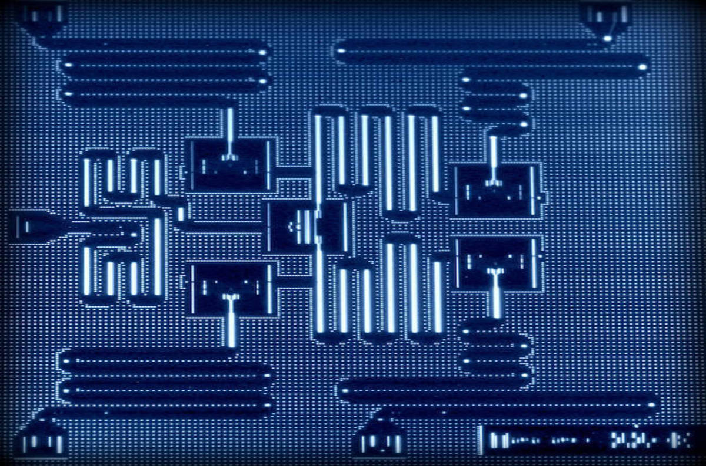
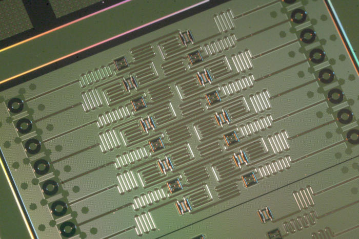
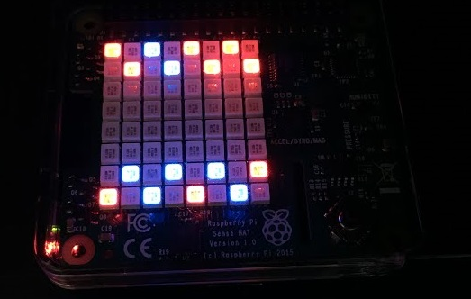

# quantum-raspberry-tie
  
Your Raspberry Pi running code on the IBM Quantum platform processors or simulators via Python 3 -- with results displayed courtesy of the 8x8 LED array on a SenseHat (or SenseHat emulator)!

## November 2024 updates

### New Interactive dialog option (_-int_)

A new _-int_ (for "interactive") option has been added. Starting the program with the -int parameter will prompt the user through a series of dialogs to select 

- Number of qubits (5, 12 or 16)
- Display mode (bowtie, tee, "hex" diamond, or 16-qubit rows, as appropriate for number of qubits)
- local simulator or online backend
- simulator model to use (dependent on number of qubits specified)

All previous options are still available if the program is invoked via the command line. The interactive mode was added to make the program more useful as a demo on menu-driven demo setups like the RasQberry Pi project.

### Assistance saving authentication credentials for IBM Quantum or IBM Cloud access

If a real processor option is requested (either to send the job to a real backend, or to model a local Aer simulator on a real processor) and no credentials have been saved via the Qiskit API, the program offers to assist in storing them. A "No" response exits gracefully.
If the user responds yes, it will then prompt for the necessary information and attempt to use the QiskitRuntime.save_account() function for either an IBM Quantum or IBM Cloud account as documented in the instructions at https://docs.quantum.ibm.com/guides/setup-channel. 
If that fails, or the service still can't be instantiated with the stored credentials, the program exits with a link to the above account authentication page.

## August 2024 update to April 2024 (Sixth) Release For Qiskit v1.x
&nbsp;&nbsp;&nbsp;&nbsp;[Previous Releases](#Previous-Releases)

This release requires the new v 1.x release of Qiskit and will not run with older versions of Qiskit.
*As of 28 August 2024 it has been tested with Qiskit 1.2, QiskitRuntime 0.28 and Qiskit Aer 0.14.2*
It defaults to building a local simulator and offers several new options. 

It has been tested on a Raspberry Pi 4B running CentOS Stream 9. It should run on most flavors of Linux on that hardware. Earlier versions of the hardware may run short on resources. The SenseHat emulator module may not work in all flavors of Linux.
Super short installation notes:
 * Follow instructions for creating a python 3 virtual environment and installing Qiskit 1.0. at https://docs.quantum.ibm.com/start/install
 * Then follow the instructions for saving your IBM Quantum Platform account to your local machine (if you want to use real backends or build simulators based on real backends) https://docs.quantum.ibm.com/start/setup-channel#set-up-to-use-ibm-quantum-platform
 * **NOTE** If the saved credentials don't exist or have expired, the program will exit with a link to instructions on how to save them properly. Also, your saved token may have simply expired. In that case, repeat the procedure for saving your IBM Quantum account info and it should restore functionality.
 * Make sure you have the SenseHat libraries and modules installed -- *See the hardware notes about using my as-is sense-faux library if the emulator fails*
 * Try running the code!
   

This code is originally designed to run on a Raspberry Pi 3 or later with the SenseHat installed. _Note: Release 6 has only been tested on a Raspberry 4_. 
The 8x8 array on the SenseHat is used to display the results.
Alternatively, if no SenseHat is detected, it will attempt to launch and use the display on a SenseHat emulator session instead. _Note that emulator display executable does not work on all processors in all flavors of Linux_. A new SVG rendering function offers an alternative to that executable.

If the Pi is held on edge, the accelerometer is used to determine which edge is "up" and orients the qubit display accordingly (default is "up" equals towards the HDMI and USB power in ports).
This version asseses the QASM program being loaded and selects either a 5-qubit or 16-qubit display accordingly. The default is to load and run a 5-qubit random number-generating program.
### Display modes
The output of running the quantum circuit is represented as a series of colored pixel blocks on the 8x8 matrix. A blue block indicates a measured "1" and a red block a measured "0". If the circuit uses/measures fewer qubits than the display can represent, unmeasured qubits are represented as a dimmer purple/lavendar color.
(The assorted pixel block patterns actually correspond to various qubit arrangements on the physical processors during the history of their development; they don't map the actual connectivity of the backend/simulator used to run the quantum circuit.)
An svg vector rendering of the array is also created and written to a folder that can be displayed via browser. This offers a view of the qubit display without requiring the sense-emu executable or a physical LED display, and will also work if accessed remotely.

#### 5-qubit displays 
**Bowtie** 

The default 5-qubit display formats output in a manner corresponding to the connectivity of the early IBM 5-qubit "bowtie" quantum processor.
 &nbsp;&nbsp;&nbsp;&nbsp;&nbsp;&nbsp;&nbsp;&nbsp;&nbsp;&nbsp;&nbsp;&nbsp;&nbsp;&nbsp;&nbsp;&nbsp;&nbsp;&nbsp;&nbsp;&nbsp;&nbsp;&nbsp;&nbsp;&nbsp;&nbsp;&nbsp;&nbsp;&nbsp;&nbsp;&nbsp;
  
(It's called a bowtie because of the arrangement of the 5 qubits, and the particular ways they can interconnect via entanglement. Each of those rectangles touched by a squiggly line in the image on the left holds a qubit.)

**Tee** 

This variation of the 5-qubit display is based on the lower-noise tee connectivity of later small processors

  

#### 12-qubit displays
**Hex**

Even though it looks like a diamond rather than a hexagon, this display is topologically equivalent to the 12-qubit "heavy hex" arrangement that is the building block for many modern IBM quantum processors, with a qubit at each vertex of a hexagon and another at the center of each side. 

Note that this is a 5-qubit result displayed on the 12 qubit display, so 7 of the pixel blocks are purple indicating unmeasured status

#### 16-qubit display
The 16 qubit display arrangement corresponds to one of the early experimental 16-qubit processors
 &nbsp;&nbsp;&nbsp;&nbsp;&nbsp;&nbsp;&nbsp;&nbsp;&nbsp;&nbsp;&nbsp;&nbsp;&nbsp;&nbsp;&nbsp;&nbsp;&nbsp;&nbsp;&nbsp;&nbsp;&nbsp;&nbsp;&nbsp;&nbsp;&nbsp;&nbsp;&nbsp;&nbsp;&nbsp;&nbsp;
 

#### SVG alternate display
As it starts, the program will create a **svg** subdirectory if one does not exist, and write (or rewrite) into it first a file named **qubits.html** and then cyclicly update another named **pixels.html** every time the main code executes the "showqubits" function.
* _qubits.html_ is an html wrapper set to refresh every 2 seconds when opened in a browser. It will repeatedly load _pixels.html_
* _pixels.html_ contains an svg rendering of the 8x8 pixel array, and a caption below it showing the qubit pattern being represented

  

Once the program is looping, if there is no physical LED array, you can watch the results of the program iteration by just opening _./svg/qubits.html_ in a browser window and leave it open; there can be a few seconds time lag between the result is returned and when the svg image updates.

### Quantum Processor options ###
_This behavior has changed significantly for Release 6 to reflect the changes in the IBM Quantum platform and Qiskit V1.0_

While the quantum circuit _may_ be sent to a real backend processor on the IBM Quantum platform, the default is to instead instantiate and use a local simulator for processing.
#### Simulators ####
**The default mode is now to run in loop mode on a local simulator**

* The default is to spin up a "FakeManilaV2" simulator, which is based on a now-retired noisy 5-qubit processor. This is equivalent to the old -local mode.
* To spin up a larger simulator, use the **-b:aer** option
* To spin up a larger simulator with a real noise model, use **-b:aer_noise** or **-b:aer_model** option _This mode requires an active internet connection to the IBM Quantum platform to pull the noise model_

#### Cloud Processors ####
_These modes requires an active internet connection to the IBM Quantum platform_

You may send the circuit to an actual IBM Quantum Platform processor backend by specifying **-b:<backend>** where <backend> is the name of a processor your account may use. 

The special case **-b:least** will automatically select the non-simulator backend with the shortest queue available to your account.
Note that "shortest queue" does not equal quick return of your job result, especialy on Open (free) accounts. It may take an hour or more for your job to actually run. **Specifying a backend other than the simulator will disable the looping component of this program and send the job only a single time to IBM Quantum.**

**Cloud simulators**

The IBM Quantum cloud simulators are being retired as of May 15, 2024. Until then, you may specify one of them as a backend, e.g. via **-b:ibmq_qasm_simulator**.
Calling a cloud simulator will leave the looping mode enabled.

* The programs can trigger a shutdown of the Raspberry Pi by means of pressing and holding the SenseHat Joystick button straight down. This is very useful when running as a headless demo from battery, as it provides a means of safely shutting down the Pi and avoiding SD card damage even without a screen and input device.
* You may also exit execution *without* a shutdown by pressing and holding the joystick button to any side. 
* Both joystick events will be detected on the emulator as well as on the SenseHat hardware.

  
# Installation

## Prerequisites
### Hardware: Raspberry Pi and SenseHat
You will need a Raspberry Pi 3 or later running a current version of Linux, with a SenseHat* hat properly installed. The code is not reliant on any particular family of Linux, as long as the SenseHat interface is functioning properly. At time of release, the code has been tested on a Raspberry Pi 4B running CentOS Stream 9.

* If your processor did not come with the SenseHat libraries pre-installed, you must install them.
     https://www.raspberrypi.org/documentation/hardware/sense-hat/
     
* Alternatively, you can install the SenseHat EMULATOR libraries instead, and simulate the SenseHat display on the emulator.
     https://sense-emu.readthedocs.io/en/v1.1/install.html
     (note that the emulator display executable does not work in all flavors of Linux on all processors)
     
* To run without a SenseHat and if the emulator executable does not run on your machine/OS, you can try using my [sensefaux repository](https://github.com/KPRoche/sense_faux) in its place. This was written a couple years ago to run SenseHat code without a sensehat or raspberry pi. **It has no visual representation of the 8x8 display, but you will see all of the stdout messages printed to the terminal.** _The sensefaux library is offered as-is; I developed it for a small project and am not actively supporting it at the moment*_
  
* *_Yes, in theory with the sense_emu or sensefaux libaries you can run this program on a machine other than a Raspberry Pi_

Your Raspberry Pi must have an active internet connection for options connecting to the IBM Quantum cloud platforms to function properly
     
### QISKit libraries and modules ###
You will need to install the **QISKit v1.x library**      [https://github.com/QISKit/](https://docs.quantum.ibm.com/start/install)
     
**IMPORTANT:** this release does require the complete QISKit library, not the simpler API library used before! 
I strongly recommend following the suggestion to create a virtual environment for your QISKit install and use it.

To build noisy simulators, you will need to also install the qiskit_aer module and libraries. After the main QISKit, execute

    pip install qiskit-aer

to add those modulles.

To use the cloud-based IBM Processors, or build a real-processor based noise model simulator,  you must have an account set up at the IBM Quantum Platform and obtain your API Token from the your account. After installing QISKit, activate the virtual environment for it and follow the instructions here to store your account authentication on your Raspberry Pi: https://docs.quantum.ibm.com/start/setup-channel#set-up-to-use-ibm-quantum-platform

Download the source code for the QuantumRaspberryTie program and the code should be ready to run!
Be sure to download the OPENQASM files as well (_expt.qasm_, _expt12.qasm_ & _expt16.qasm_) for the probram and put them in the same directory as your source file.

# Versions
There is now a single version of the code, which can run in one of two quantum processor-size modes. 
Both require that the **sense-hat**, **sense-emu** and **qiskit** libraries be installed in order to function, and use the **threading**, **time**, and **datetime** modules.

## QuantumRaspberryTie.qk1.py
If running with any options requiring data from the online IBM Quantum platform, this program tries to test its connection to the IBM Quantum website before making requests. 
It will prompt for authentication information and save it via the QiskitRuntime.save_account() method if you wish to do so.
It's designed to cope somewhat gracefully with what happens if you are running on batteries and your Raspberry Pi switches wireless access points as you move around, or are in a somewhat glitchy wifi environment. It also can now handle gracefully communications timeouts with the IBM Quantum cloud, or the occasional glitch where the simulator queue status for a job gets stuck in "RUNNING" state.

To start the program, after activating the qiskit virtual environment, simply call it from its directory (on my system, the default version of python is python 3.9; add the version number if necessary on your system):
+     *python QuantumRaspberryTie.qk1*  
          will launch with the default (5-qubit) quantum circuit 
          
+     *python QuantumRaspberryTie.qk1 16*  
          will launch with the 16-qubit circuit
+     *python QuantumRaspberryTie.qk1* _yourprogram.qasm_  
          will launch and attempt to load the circuit specified in file _yourprogram.qasm_
          
## Command line parameters (can be stacked with spaces between them) 
      Backend options:
           -b:aer | spins up a local Aer simulator
           -b:aer_noise or -b:aer_model | spins up a local Aer simulator with a noise model 
               based on the least busy real processor for your account (this does require access to
               the IBM Quantum processors and account credentials properly saved via QiskitRuntime
           -b:least | will run code once on the least busy *real* backend for your account
               NOTE: this may take hours before the result returns
           -b:[backend_name] | will use the specified backend if it is available (see note above)
        NEW display options
           NOTE: if multiple options are specified the last one in the parameters will be applied
           hex or -hex | displays on a 12 qubit pattern 
                    (topologically identical to the heavy hex in IBM processors) 
           d16 or -d16 | displays on a 16 qubit pattern
               NOTE: overrides default or tee option for 5 qubit code!
          -tee
             will display 5-or-less qubit circuit results in  "tee" arrangement like the newer processors instead of in the "bowtie" arrangement

               NOTE: if your quantum circuit has fewer qubits than available in the display mode, 
                   unmeasured qubits will be displayed in purple
                  
        NEW interactive options 
           -int   | ignores any other command line parameters except debug, and guides the user to set up a run via interactive prompts.
           -input | prompts you to add more parameters to what was on the command line
           -select | prompts you for the backend option before initializing
        OTHER options:
           -16 or 16 | loads a 16-qubit QASM file and switches to a 16-bit display arrangement
               NOTE: hex display mode will override the 16 qubit display and show only the first 12
           -noq | does not show a logo during the rainbow "thinking" moment; instead rainbows the qubit display
           -e | will attempt to spin up a SenseHat emulator display on your desktop. 
           -dual | will attempt to display on BOTH the SenseHat and a emulator display
               These require that both the libraries and a working version of the emulator executable be present
           -f:filename load an alternate QASM file
         
After loading libraries, the program checks the SenseHat accelerometer to see which way the Pi is oriented. If it is flat on a table, "up" will be towards the power and display connectors on the Pi. If you wish to change the display orientation, simply hold the pi in the orientation you want until an up arrow appears on the display. The program will now use that orientation until the next cycle.

The program then pings the IBM Quantum Platform webserver to make sure it has a connection; if not and one is needed it will exit. 
If access to real quantum backends is required, it confirms that authentication is successful; if not, it will offer the option to prompt and store account information for either IBM Quantum or IBM Cloud authentication.

It then loads the OPENQASM code for the experiment from a separarate text file, _expt.qasm_ (or _expt16.qasm_) which makes it easier to modify your experiment code. If the first ping was successful, in each cycle it pings again before it confirms the backend status and (presuming the backend is not busy) sending the OPENQASM code. If there no good response to the ping, or the backend responds as busy, it waits 10 seconds and tries again, begining again with that initial ping to the website. 

If the ping is good, it then connects to the IBM Quantum Experience API using your token and initializes the LED display (displaying a Bloch sphere logo). It compiles the OPENQASM code into a "quantum circuit", echoes the quantum circuit drawing to the terminal. and then sends the quantum circuit to the processor to execute. While it waits for the response, it cycles the light display through a rainbow shift to indicate that the system is "thinking". Once the result is returned by the processor, the measured values of the qubits are displayed as either red (measured 0) or blue (measured 1). Unused/unmeasured qubits in the display will show as purple

The system will pause for a few seconds, then run the code again (flashing the logo as it starts) to display a new result. You may trigger a new run sooner by pressing the SenseHat joystick in any direction. If you want to change which way on the display is "up" simply hold the Pi in the correct orientation until the logo displays as the cycle starts (the position is measured before sending the job).
*If you specify one of the non-simulator backends using the **-b** option, the program will not run in a loop, but will instead exit after sending the quantum circuit to IBM Q and displaying the result once. This is to avoid burning up your "credits" in the IBM Q Experience.*

In each cycle, the status of the backend is checked and printed to the console, as is the quantum circuit diagram, then the probability value and measured bit pattern of the most-frequent result which is used for the display subroutine going out to the LED arrays and SVG rendering

To stop the loop and exit execution, press and hold the joystick button on the SenseHat to any of the 4 sides.

To stop the program and shut down the Pi, press and hold  (center press) the joystick button on the SenseHat. The color display will stop cycling, it will briefly display **OFF** on the LED array, and then the Pi will shut down. When the green light on the Pi stops flashing, it is safe to disconnect power.

**NOTE** If you are running using the SenseHat emulator and click and hold the emulator GUI joystick button, it *will* shut down your rPi. Don't leave unsaved files open if you are going to test this.

Both versions run the display by spawning a second thread. As long as the variable *thinking* is True, the rainbow cycle is run. If it is False, the value of the string variable *maxpattern* is translated into the red and blue qubit display.

The "blinky" and "showqubits" functions in the code are generalized to work with a global *display* variable. Setting that to equal the list defining the 5-qubit processor (ibm_qx5) will result in the bowtie display, to the ibm_qx5t gives the tee display, to ibm_qhex gives the 12 qubit display, and setting it equal to the 16 (ibm_qx16) will result in the 16 bit display. New since version 4: the default is for blinky to use the a logo for the rainbow "thinking" display; specifying -noq as a start parameter will use the qubit pattern instead.

## The OPENQASM code being run
The program being run on the 5-qubit processor is very simple. 5 qubits are initialized to the ground state, a Hadamard gate is applied to each one to place it into a state of full superposition, then each is measured. The net effect is a 5-bit random number generator. Only 10 shots are run, so one pattern should always randomly end up higher in the results. The code is found in the variable *qasm* in both versions. It looks like this:

     OPENQASM 2.0;
     include "qelib1.inc";
     qreg q[5];
     creg c[5];
     h q[0];
     h q[1];
     h q[2];
     h q[3];
     h q[4];
     measure q[0] -> c[0];
     measure q[1] -> c[1];
     measure q[2] -> c[2];
     measure q[3] -> c[3];
     measure q[4] -> c[4];

The 16-qubit version does exactly the same thing only with 16 quantum registers and 16 classical registers. 

## acknowledgements
The color-shifting technique in the "thinking" display while waiting for the result from the processor is based on the rainbow.py example included with the SenseHat library.

The Ping function is based on that in the Pi-Ping program by Wesley Archer (c) 2017 
             https://github.com/raspberrycoulis/Pi-Ping

I also want to acknowledge Alex Lennon of Dynamic Devices, whose work on a docker template for an IOT project gave me hints on getting the Qiskit install to work on my Raspberry Pi : https://github.com/DynamicDevices/does-rpi3-qiskit

##  Previous Releases ##
#### Fifth Release: -dual option:  adding Dual Display option. The -dual parameter will spin up a Sensehat emulator as well as use the display on a physical Sensehat, if one is detected. If no physical hat is installed, this parameter is ignored and the emulator alone will be spun up.
(Only the orientation of the physical display will change according to the rotation of the Raspberry Pi)

#### Fourth Release: -local option: can run on local Aer qasm_simulator backend instead of using IBM Quantum backends via network! -noise option runs local simulator with a noise model based on a real processor. Parses newer version numbers of qiskit properly

#### Third Release: will fail over to SenseHat emulator if no SenseHat hardware is detected. You may opt to send your quantum circuit to an actual quantum processor backend at IBM Quantum instead of the simulator

## Release History ##
*    v6 : Rewrite for Qiskit v1.0, new "thinking" logo and command/display options. Default to local 5-qubit simulator
*    v5 : added dual display mode
*    v4 : added local option
*    v3 : auto-fail over to SenseHat emulator if no SenseHat hardware is detected.
*    v2.1 : additional queue stall exception handling
*    v2.0 : Adapt to version of Qiskit installed
*    v1.0 : uses full Qiskit library; detects orientation of rPi and changes display angle.

